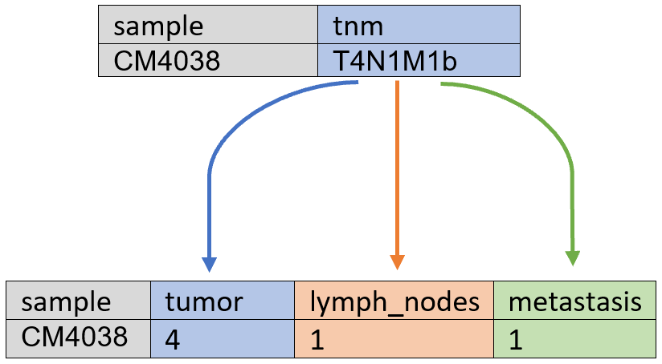
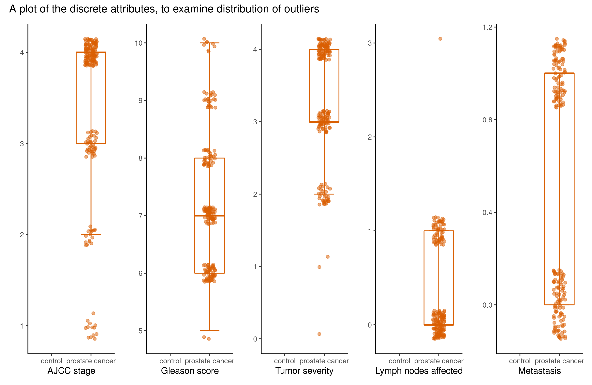

```{r setup, include=FALSE}
knitr::opts_chunk$set(echo = FALSE)
library("tidyverse")
```

## Data set overview
```{r read data_load, include = FALSE}
data_load <- read_csv("../data/01_dat_load.csv",
                      show_col_types = FALSE)
data_clean <- read_csv("../data/02_dat_clean.csv",
                       show_col_types = FALSE)
data_aug <- read_csv("../data/03_dat_aug.csv",
                     show_col_types = FALSE)
```
**Title:** "Peripheral Blood Mitochondrial DNA Copy Number Is Associated with Prostate Cancer Risk and Tumor Burden"  
**Authors:** Zhou W. et. al. (2014)  
**Purpose:** Predict cancer from biomarkers, mainly mtDNA

<div style="float: left; width: 50%;">
**Loading**  

- Dimensions: `r dim(data_load)` 

- Control and cancer case groups are proportional

**Cleaning**  

- Check for duplicates

- Filter for PCR success (pcr_success)

- New dimensions: `r dim(data_clean)` 
</div>

<div style="float: right; width: 50%;">

**Augmenting**  

- BMI- and DFI-classifier

- New columns based on TNM-notation

- Add 'group' as strings

- New dimensions: `r dim(data_aug)`

```{r out.width="90%"}

```

</div>

## Flowchart for project flow
```{r out.height="100%", fig.align='center'}

```

## Boxplot with continuous variables, any outliers?
```{r out.width="90%", fig.align='center'}
knitr::include_graphics("../results/boxplot_continuous.png")
```

## Boxplot with discrete variables, any outliers?
```{r out.width="90%", fig.align='center'}

```

## Re-creating plot from the article
```{r echo=FALSE,out.width="49%", out.height="10%",fig.cap=" ",fig.show='hold',fig.align='center'} 
knitr::include_graphics(c("../docs/Zhou_et_al_boxplot.png",
                          "../results/article_visualization.png"))
```

## A better biomarker for prostate cancer?
```{r out.width="80%",fig.align='center'}
knitr::include_graphics("../results/boxplot_psa.png")
```

## Some exploratory data analysis
```{r out.width="100%", fig.align='center'}
knitr::include_graphics("../results/simplified_mtdna_vs_psa.png")
```

## Logistic regression, excl. PSA {.build}
Significant p-values:
```{r}
read_csv("../results/logistic_regression_mtdna.csv",
         show_col_types = FALSE) %>%
  filter(identified_as == "Significant") %>% 
  rmarkdown::paged_table()
```

<div>
Maybe the distribution of DFI-classes are skewed?
```{r}
data_aug %>% 
  select(dfi_class, group) %>% 
  count(dfi_class, group) %>% 
  distinct() %>% 
  rmarkdown::paged_table()
```
</div>

## Logistic regression, incl. PSA
Significant p-values:
```{r}
read_csv("../results/logistic_regression_psa.csv",
         show_col_types = FALSE) %>%
  filter(identified_as == "Significant") %>% 
  rmarkdown::paged_table()
```

## Principal component analysis (PCA)
```{r echo=FALSE,out.width="49%", out.height="10%",fig.cap=" ",fig.show='hold',fig.align='center'}
knitr::include_graphics(c("../results/pc1_vs_pc2.png",
                          "../results/pca_var_explained.png",
                          "../results/pc1_pc2_weights.png"))
```

## Interesting finding during exploratory data analysis
```{r out.width="80%", fig.align='center'}
knitr::include_graphics("../results/boxplot_bmi_dfi.png")
```

## Conclusion {.build}
- We can support the conclusion of the article, mtDNA is a biomarker for prostate cancer and cancer severity (e.g, it is reproducible)  

<div>
- PSA levels are better for cancer prediction
</div>

<div>
- Both of the above could be supported by Logistic Regression and PCA
</div>
