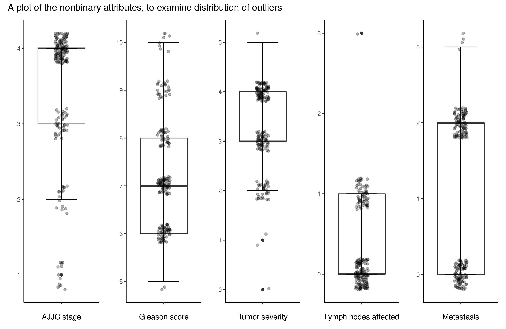
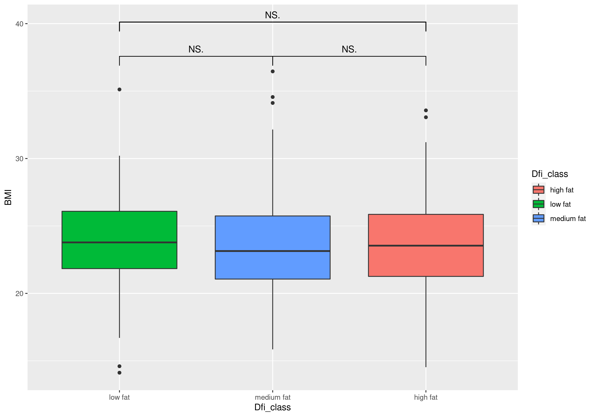

```{r setup, include=FALSE}
knitr::opts_chunk$set(echo = FALSE)
library(tidyverse)
library(rmarkdown)
library(knitr)
```

## Slide with Bullets

- Bullet 1
- Bullet 2
- Bullet 3

# Slide with increments {.build}
<div>
Here is something
</div>
<div>
Here is another thing
</div>

## Slide with R Output
```{r read data, include=FALSE}
data <- read_csv("../data/03_dat_aug.csv")
```


```{r data summary, echo = TRUE}
summary(data)
```

## Slide with half of the outliers

```{r out.width="100%",out.height="100%"}
knitr::include_graphics("../results/OutlierPlot1.png")
```

## Slide with other half of the outliers

```{r out.width="100%",out.height="100%"}

```


## Slide with PCA


```{r echo=FALSE,out.width="49%", out.height="10%",fig.cap="PCA",fig.show='hold',fig.align='center'}
knitr::include_graphics(c("../results/pc1_vs_pc2.png",
                          "../results/pca_var_explained.png",
                          "../results/pc1_pc2_weights.png"))
```

## Interesting Boxplot
```{r out.width="100%",out.height="100%"}

```


## Logistic regression {.build}

```{r}
read_rds("../results/Logistic_regression.rds") %>%
  filter(term == str_match(term, "PSA")) %>% 
  paged_table()
```
<div>
```{r}
data %>% 
  select(Dfi_class, Group) %>% 
  count(Dfi_class, Group) %>% 
  distinct() %>% 
  paged_table()
```
</div>
