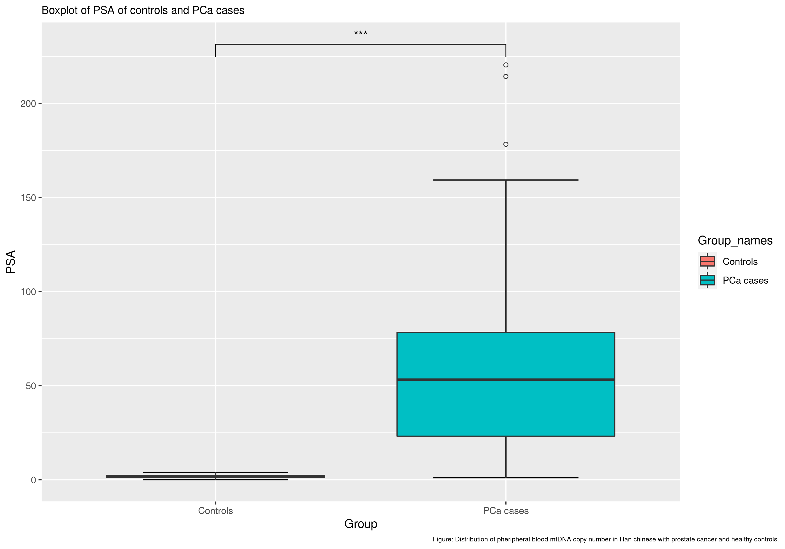

```{r setup, include=FALSE}
knitr::opts_chunk$set(echo = FALSE)
library(tidyverse)
library(rmarkdown)
library(knitr)
```

## Data set overview
```{r read data_load, include = FALSE}
data_load <- read_csv("../data/01_dat_load.csv") 
```

- Dimensions of the raw data set: `r dim(data_load)` 


- Stratified on Controls and PCa cases (attribute called Group)  


- Purpose of article: Predict PCa from other variables, mainly mtDNA  

## Cleaning and augment of data set {.build}
```{r read data_clean, include = FALSE}
data_clean <- read_csv("../data/02_dat_clean.csv") 
```

```{r data_aug, include = FALSE}
data_aug <- read_csv("../data/03_dat_aug.csv")
```
<div>
**Cleaning**  

- Check for duplicates  


- Filter for pcr_success  


- New dimensions: `r dim(data_clean)`  
</div>
<div>
**Augmenting**  

- bmi- and dfi-classifier  


- New columns based on TNM-notation  


- Add "group" as strings  


- New dimensions: `r dim(data_aug)`  
</div>

## Boxplot with continuous variables, any outliers?
```{r out.width="90%", fig.align='center'}
knitr::include_graphics("../results/boxplot_continuous.png")
```

## Boxplot with discrete variables, any outliers?
```{r out.width="90%", fig.align='center'}
knitr::include_graphics("../results/boxplot_discrete.png")
```

## Re-creating plot from the article
```{r echo=FALSE,out.width="49%", out.height="10%",fig.cap="Article visualization",fig.show='hold',fig.align='center'}
knitr::include_graphics(c("../results/article_visualization.png",
                        "../docs/Zhou_et_al_boxplot.png"))
```

## A better biomarker for PCa?
```{r out.width="100%"}

```

## Interesting finding during exploratory data analysis
```{r out.width="80%", fig.align='center'}
knitr::include_graphics("../results/Boxplot_BMI_Dfi.png")
```

## Logistic regression, excl. PSA {.build}
Significant p-values:
```{r}
read_csv("../results/Logistic_regression_mtDNA.csv",
         show_col_types = FALSE) %>%
  filter(identified_as == "Significant") %>% 
  paged_table()
```

<div>
Maybe the distribution of Dfi-classes are skewed?
```{r}
data_aug %>% 
  select(dfi_class, group) %>% 
  count(dfi_class, group) %>% 
  distinct() %>% 
  paged_table()
```
</div>

## Logistic regression, incl. PSA
Significant p-values:
```{r}
read_csv("../results/Logistic_regression_PSA.csv",
         show_col_types = FALSE) %>%
  filter(identified_as == "Significant") %>% 
  paged_table()
```

## Principal component analysis (PCA)
```{r echo=FALSE,out.width="49%", out.height="10%",fig.cap="PCA",fig.show='hold',fig.align='center'}
knitr::include_graphics(c("../results/pc1_vs_pc2.png",
                          "../results/pca_var_explained.png",
                          "../results/pc1_pc2_weights.png"))
```

## Conclusion {.build}
- We can support the conclusion of the article, mtDNA is a biomarker for PCa (e.g, it is reproducible)  

<div>
- PSA levels seem to be an even better biomarker
</div>

<div>
- Both of the above could be supported by logistic regression
</div>

<div>
- Conclusion for PCA?
</div>