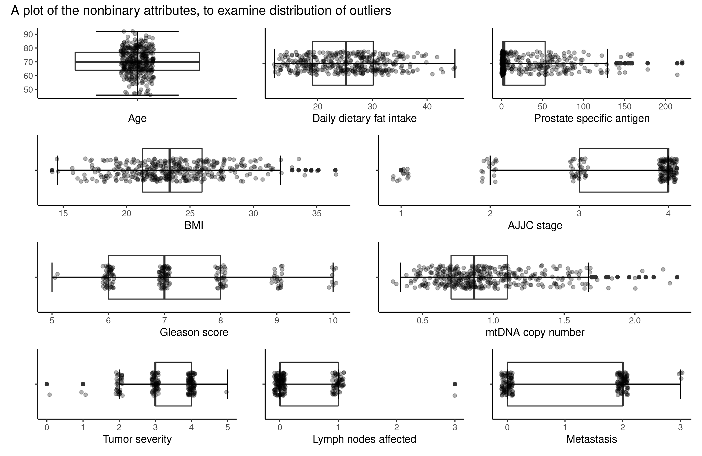

```{r setup, include=FALSE}
knitr::opts_chunk$set(echo = FALSE)
library(tidyverse)
```

## R Markdown

This is an R Markdown presentation. Markdown is a simple formatting syntax for authoring HTML, PDF, and MS Word documents. For more details on using R Markdown see <http://rmarkdown.rstudio.com>.

When you click the **Knit** button a document will be generated that includes both content as well as the output of any embedded R code chunks within the document.

## Slide with Bullets

- Bullet 1
- Bullet 2
- Bullet 3

## Slide with R Output
```{r read data, include=FALSE}
data <- read_csv("../data/03_dat_aug.csv")
```


```{r data summary, echo = TRUE}
summary(data)
```

## Slide with Image

```{r out.width="100%",out.height="100%"}

```

## Slide with PCA


```{r echo=FALSE,out.width="49%", out.height="10%",fig.cap="PCA",fig.show='hold',fig.align='center'}
knitr::include_graphics(c("../results/pc1_vs_pc2.png",
                          "../results/pca_var_explained.png",
                          "../results/pc1_pc2_weights.png"))
```

