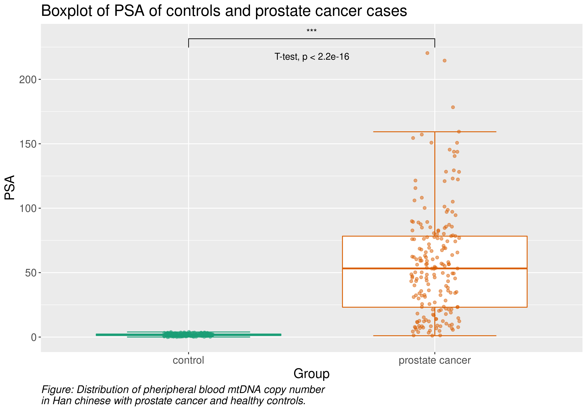

```{r setup, include=FALSE}
knitr::opts_chunk$set(echo = FALSE)
library("tidyverse")
```
## Article introduction

**Title:** "Peripheral Blood Mitochondrial DNA Copy Number Is Associated with Prostate Cancer Risk and Tumor Burden"

**Authors:** Weimin Zhou, Min Zhu, Ming Gui, Lihua Huang, Zhi Long, Li Wang, Hui Chen, Yinghao Yin, Xianzhen Jiang, Yingbo Dai, Yuxin Tang, Leye He, Kuangbiao Zhong

**Goal:** Determine if mtDNA is a predictor for prostate cancer

## Flowchart for project flow
```{r out.width="90%", fig.align='center'}
#knitr::include_graphics("../docs/flowchart.png")
```

## Data set overview
```{r read data_load, include = FALSE}
data_load <- read_csv("../data/01_dat_load.csv",
                      show_col_types = FALSE)
data_clean <- read_csv("../data/02_dat_clean.csv",
                       show_col_types = FALSE)
data_aug <- read_csv("../data/03_dat_aug.csv",
                     show_col_types = FALSE)
```

<div style="float: left; width: 50%;">
**Loading**  

- Dimensions of the raw data set: `r dim(data_load)` 

- Stratified on Controls and PCa cases (attribute called Group)  

- Purpose of article: Predict PCa from other variables, mainly mtDNA

**Cleaning**  

- Check for duplicates  

- Filter for PCRsuccess  

- New dimensions: `r dim(data_clean)` 
</div>

<div style="float: right; width: 50%;">

**Augmenting**  

- BMI- and DFI-classifier  

- New columns based on TNM-notation  

- Add "Group" as strings  

- New dimensions: `r dim(data_aug)` 

```{r out.width="90%"}
knitr::include_graphics("../docs/tnm_notation.png")
```

</div>

## Boxplot with continuous variables, any outliers?
```{r out.width="90%", fig.align='center'}
knitr::include_graphics("../results/boxplot_continuous.png")
```

## Boxplot with discrete variables, any outliers?
```{r out.width="90%", fig.align='center'}
knitr::include_graphics("../results/boxplot_discrete.png")
```

## Re-creating plot from the article
```{r echo=FALSE,out.width="49%", out.height="10%",fig.cap="Article visualization",fig.show='hold',fig.align='center'}
knitr::include_graphics(c("../docs/Zhou_et_al_boxplot.png",
                          "../results/article_visualization.png"))
```

## A better biomarker for PCa?
```{r out.width="100%"}

```

## Logistic regression, excl. PSA {.build}
Significant p-values:
```{r}
read_csv("../results/logistic_regression_mtdna.csv",
         show_col_types = FALSE) %>%
  filter(identified_as == "Significant") %>% 
  rmarkdown::paged_table()
```

<div>
Maybe the distribution of Dfi-classes are skewed?
```{r}
data_aug %>% 
  select(dfi_class, group) %>% 
  count(dfi_class, group) %>% 
  distinct() %>% 
  rmarkdown::paged_table()
```
</div>

## Logistic regression, incl. PSA
Significant p-values:
```{r}
read_csv("../results/logistic_regression_psa.csv",
         show_col_types = FALSE) %>%
  filter(identified_as == "Significant") %>% 
  rmarkdown::paged_table()
```

## Principal component analysis (PCA)
```{r echo=FALSE,out.width="49%", out.height="10%",fig.cap="PCA",fig.show='hold',fig.align='center'}
knitr::include_graphics(c("../results/pc1_vs_pc2.png",
                          "../results/pca_var_explained.png",
                          "../results/pc1_pc2_weights.png"))
```

## Interesting finding during exploratory data analysis
```{r out.width="80%", fig.align='center'}
knitr::include_graphics("../results/boxplot_bmi_dfi.png")
```

## Some more data exploration
```{r out.width="100%", fig.align='center'}
knitr::include_graphics("../results/mtdna_vs_psa.png")
```


## Conclusion {.build}
- We can support the conclusion of the article, mtDNA is a biomarker for PCa (e.g, it is reproducible)  

<div>
- PSA levels seem to be an even better biomarker
</div>

<div>
- Both of the above could be supported by logistic regression
</div>

<div>
- Conclusion for PCA?
</div>

<div>
- Some further research? Should be possible to do classification on Gleason scores/AJCC, should also be possible to do regression (albeit out of the scope of this course)
</div>