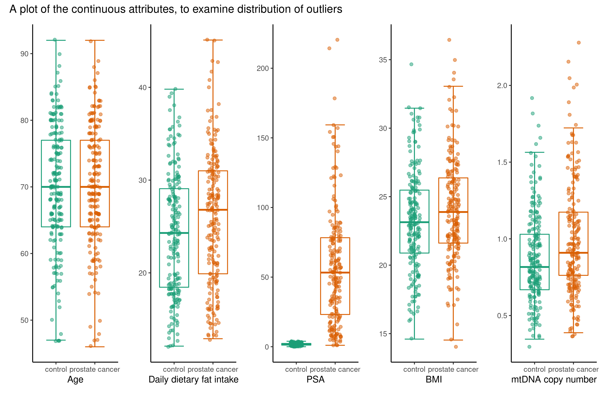
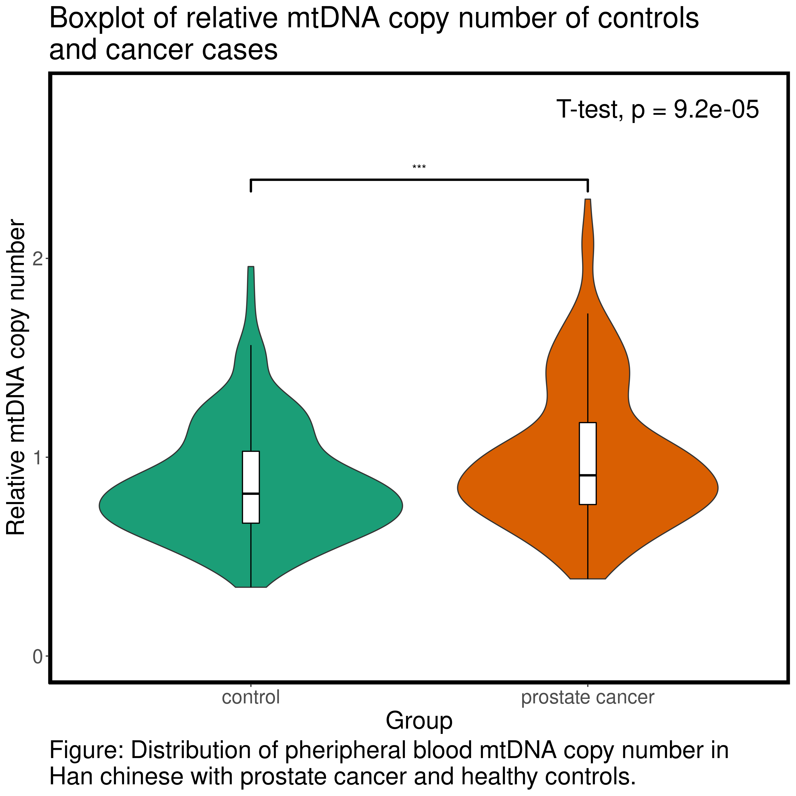

```{r setup, include=FALSE}
knitr::opts_chunk$set(echo = FALSE)
library(tidyverse)
library(rmarkdown)
library(knitr)
```

## Data set overview {.build}
```{r read data_load, include = FALSE}
data_load <- read_csv("../data/01_dat_load.csv") 
```

- Dimensions of the data set: `r dim(data_load)` 

<div>
- Stratified on Controls and PCa cases  
</div>

<div>
- Purpose of article: Predict PCa from other variables  
</div>


## Cleaning and augment of data set {.build}
```{r read data_clean, include = FALSE}
data_clean <- read_csv("../data/02_dat_clean.csv") 
```

```{r data_aug, include = FALSE}
data_aug <- read_csv("../data/03_dat_aug.csv")
```
**Cleaning**  

<div>
- Check for duplicates  
</div>

<div>
- Filter for PCRsuccess  
</div>

<div>
- New dimensions: `r dim(data_clean)`  
</div>
<div>
**Augmenting**  


- BMI- and Dfi-classifier  
</div>

<div>
- New columns based on TNM-notation  
</div>

<div>
- Add Group as strings  
</div>

<div>
- New dimensions: `r dim(data_aug)`  
</div>

## Boxplot with continuous variables, any outliers?
```{r out.width="100%", out.height="100%"}

```

## Boxplot with discrete variables, any outliers?
```{r out.width="100%", out.height="100%"}
knitr::include_graphics("../results/boxplot_discrete.png")
```

## Re-creating plot from the article
```{r out.width="100%"}

```

## A better biomarker for PCa?
```{r out.width="100%"}
knitr::include_graphics("../results/boxplot_PSA.png")
```

## Principal component analysis (PCA)
```{r echo=FALSE,out.width="49%", out.height="10%",fig.cap="PCA",fig.show='hold',fig.align='center'}
knitr::include_graphics(c("../results/pc1_vs_pc2.png",
                          "../results/pca_var_explained.png",
                          "../results/pc1_pc2_weights.png"))
```

## Interesting Boxplot
```{r out.width="100%",out.height="100%"}
knitr::include_graphics("../results/Boxplot_BMI_Dfi.png")
```

## Logistic regression, incl. PSA {.build}
Significant p-values:
```{r}
read_rds("../results/Logistic_regression_PSA.rds") %>%
  filter(identified_as == "Significant") %>% 
  paged_table()
```

<div>
Maybe the distribution of Dfi-classes are skewed?
```{r}
data_aug %>% 
  select(Dfi_class, Group) %>% 
  count(Dfi_class, Group) %>% 
  distinct() %>% 
  paged_table()
```
</div>

## Logistic regression, excl. PSA {.build}
Significant p-values:
```{r}
read_rds("../results/Logistic_regression_mtDNA.rds") %>%
  filter(identified_as == "Significant") %>% 
  paged_table()
```


## Conlusion